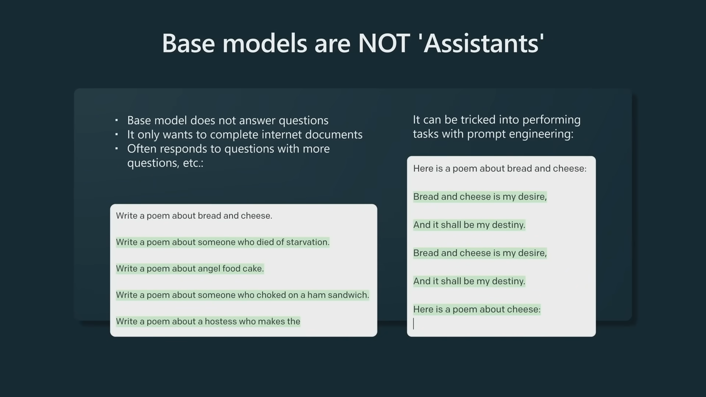
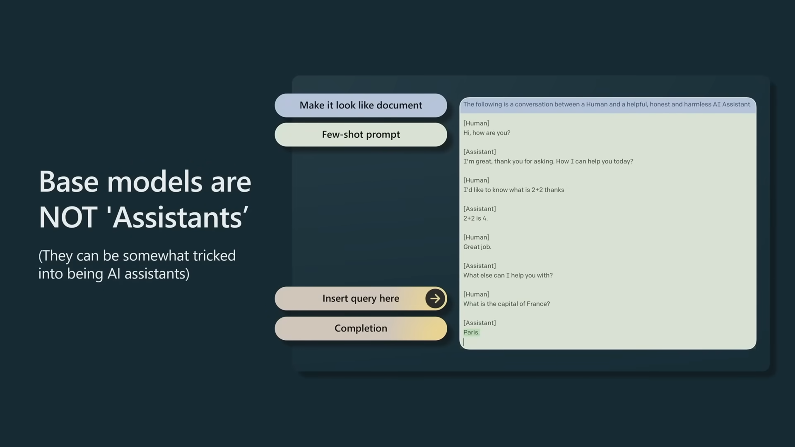
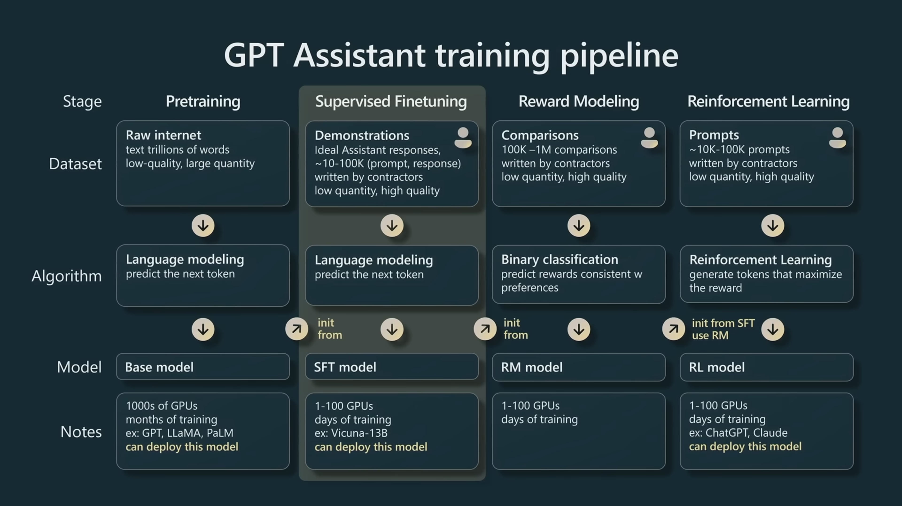
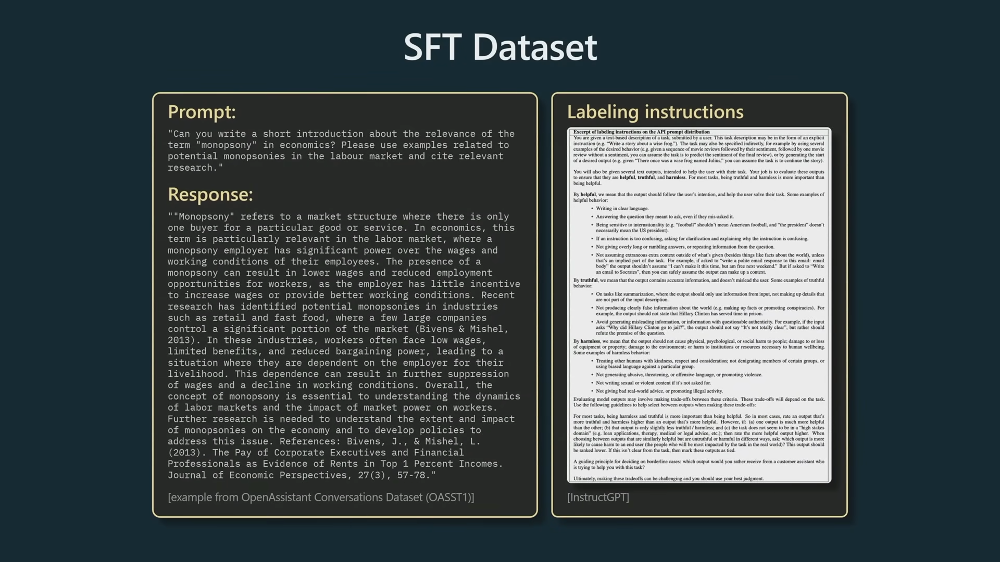
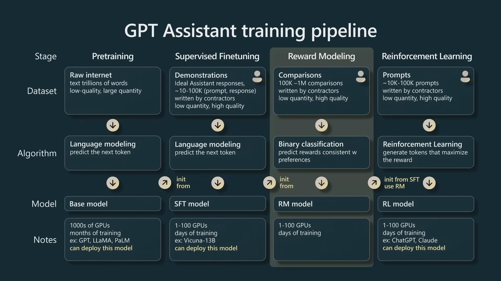
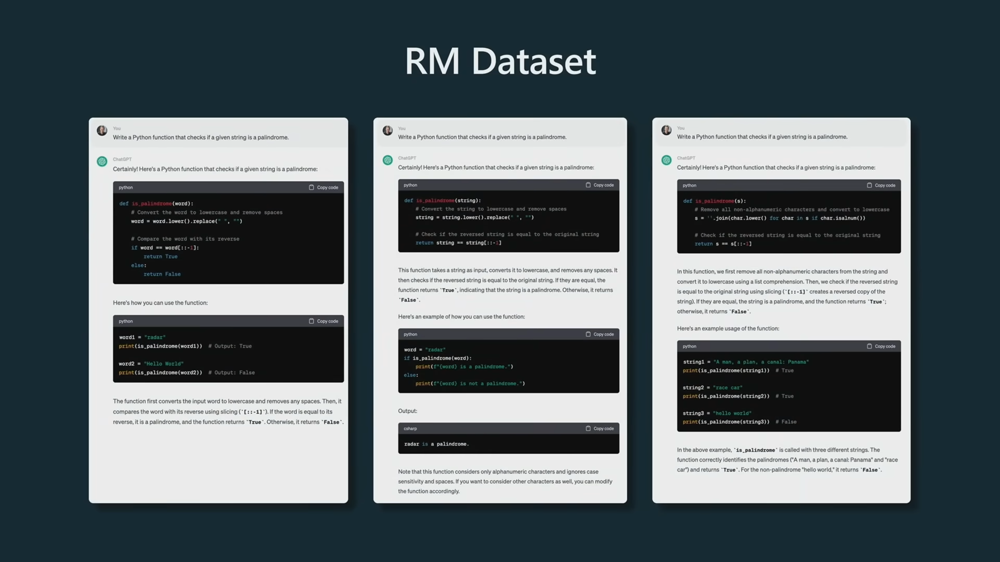
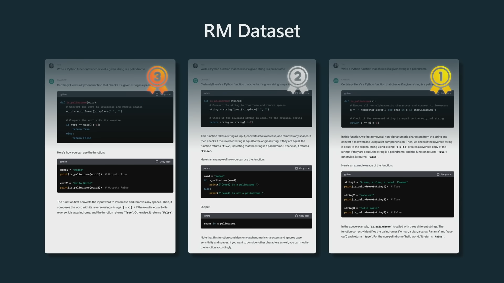

# Assistants

**Assistants are not base models.** We do not want them to answer our questions. We just want them to complete sentences.

## Video

Link: [https://youtu.be/bZQun8Y4L2A?t=633](https://youtu.be/bZQun8Y4L2A?t=633)

<iframe width="100%" height="100%" src="https://www.youtube.com/embed/bZQun8Y4L2A?start=635" title="YouTube video player" frameborder="0" allow="accelerometer; autoplay; clipboard-write; encrypted-media; gyroscope; picture-in-picture; web-share" allowfullscreen></iframe>

## Slides

